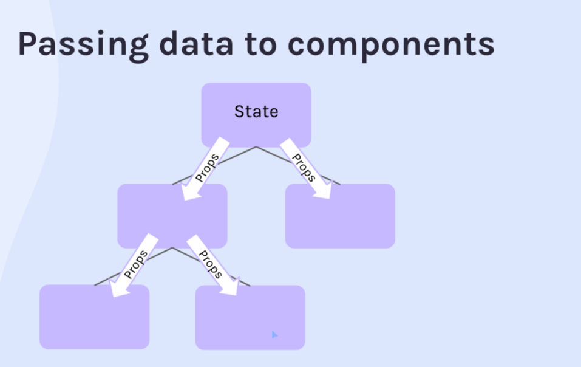
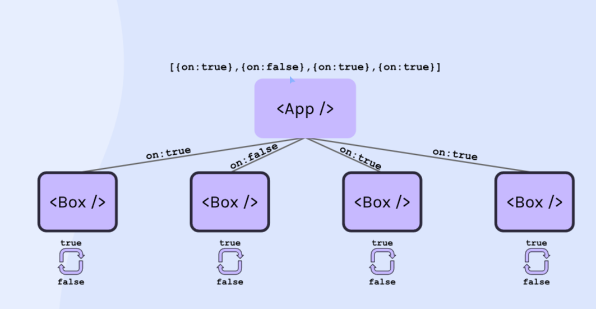
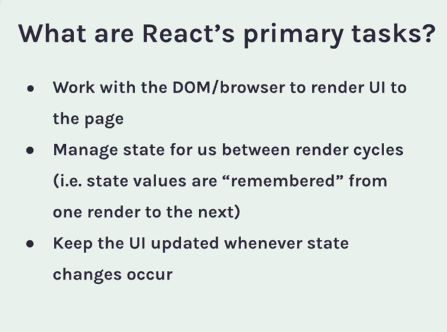
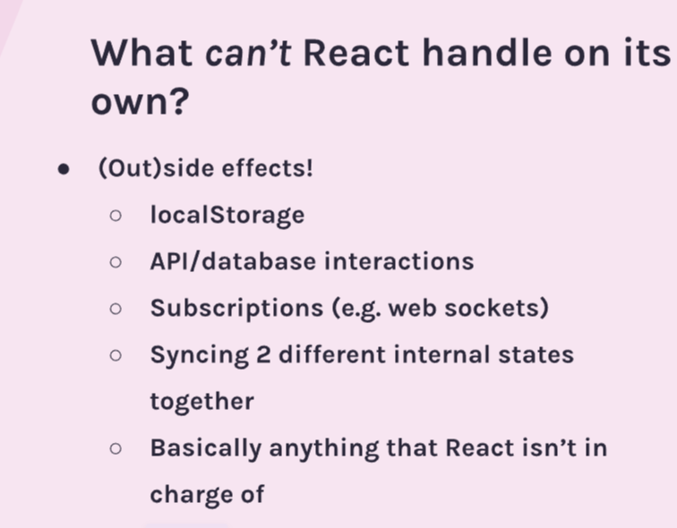

# Why React?

### Writting composable code
- small pieces of code putting together
- customized web ui components

```
function MainContent() {
    return (
        <h1>I'm learning React!</h1>
    )
}

ReactDOM.render(
    <div>
        <MainContent />
    </div>,
    document.getElementById("root")
)
```

### Writting declarative code

> Declarative programming is a programming paradigm that expresses the logic of a computation without   describing its control flow. Declarative Programming is like asking your friend to fix your car. You don’t care how to fix it, that’s up to her.

> Imperative programming is a programming paradigm that uses statements that change a program’s state Imperative Programming is like your friend calling your father that tells her how to fix your car step by step.

# React setup
https://reactjs.org/docs/add-react-to-a-website.html

# JSX

```
const h1 = document.createElement("h1")
h1.textContent = "Hello world"
h1.className = "header"
console.log(h1)

// <h1 class="header">

const element = <h1 className="header">This is JSX</h1>
console.log(element)

/*
    {
        type: "h1", 
        key: null, 
        ref: null, 
        props: {className: "header", children: "This is JSX"}, 
        _owner: null,
        _store: {}
    }
 */

// JSX
ReactDOM.render(element, document.getElementById("root"))

// JSX
const page = (
    <div>
        <h1 className="header">This is JSX</h1>
        <p>This is a paragraph</p>
    </div>
)

console.log(page)

/*
    {
        type: "div",
        key: null,
        ref: null,
        props: {
            children: [
                {type: "h1", key: null, ref: null, props: {className: "header", children: "This is JSX"}, _owner: null, _store: {}},
                {type: "p", key: null, ref: null, props: {children: "This is a paragraph"}, _owner: null, _store: {}}
                ]
            },
        _owner: null,
        _store: {}}
 */
```

- What's wrong with this code:
> We need our JSX to be nested under a single parent element

```
const page = (
    <h1>Hello</h1>
    <p>This is my website!</p>
)
```

-  What is a React component?
> A function that returns React elements. (UI)

```
// React dependency introduction
function Profile() {
    return (
        <div>
            </img>
        </div>
    )
}

ReactDOM.render(
    <Profile/>,
    document.getElementById("profile")
)
```

```
    # npm
    export NVM_DIR="$HOME/.nvm"
    [ -s "$NVM_DIR/nvm.sh" ] && \. "$NVM_DIR/nvm.sh"
    [ -s "$NVM_DIR/bash_completion" ] && \. "$NVM_DIR/bash_completion"
```

# Static Web Pages Vs Dynamic Web Apps
### Static Web Pages
- Read-only, no changes to data
### Dynamic Web Apps
- Read-write, ability to change data
- Highly interactive
- Display the user's data

# Event Listeners

```
import React from "react"

export default function App() {
    function handleClick() {
        console.log("I was clicked!")
    }
    
    function handleOnMouseOver() {
        console.log("MouseOver")
    }

    return (
        <div className="container">
            
            <button onClick={handleClick}>Click me</button>
        </div>
    )
}
```

# Generate components and React State
> Map over the thingsArray to generate a <p> element for each item and render
> them on the page below the button
```
import React from 'react';
import ReactDOM from 'react-dom';

function App() {
    const thingsArray = ["Thing 1", "Thing 2"]
    const thingsElements = thingsArray.map(thing => <p key={thing}>{thing}</p>)
    
    return (
        <div>
            {thingsElements}
        </div>
    )
}

ReactDOM.render(<App />, document.getElementById('root'));
```

## React State

```
import React from 'react';
import ReactDOM from 'react-dom';

function App() {
    const [things, setThings] = React.useState(["Thing 1", "Thing 2"])
    
    function addItem() {
        const newThingText = `Thing ${things.length + 1}`
        setThings(prevState => [...prevState, newThingText])
    }
    
    const thingsElements = things.map(thing => <p key={thing}>{thing}</p>)
    
    return (
        <div>
            <button onClick={addItem}>Add Item</button>
            {thingsElements}
        </div>
    )
}

ReactDOM.render(<App />, document.getElementById('root'));
```

### State Vs Props
- Props
> "Props" refers to the properties being passed into a component in order
> for it to work properly (configure it), similar to how a function receives parameters.
> A component receiving props is not allowed to modify those props.
> (i.e. They are "immutable")
- States
> "States" refers to values that are managed by the component, similar to variables declared
> inside a function. Anytime you have changing values that should be saved/displayed, you'll
> likely be using states.

```
    const result = React.useState()
    console.log(result)
    # [undefined, ƒ()]

    const result = React.useState("Hello")
    console.log(result)
    # ["Hello", ƒ()]

    # Destructuring
    const [result, func] = React.useState("Yes")
    console.log(result)
    # "Yes"

    # Changing State
    const [isImportant, setIsImportant] = React.useState("Yes")
    setIsImportant("No")

    # using Callback
    const [count, setCount] = React.useState(0)
    
    function add() {
        setCount(function(oldCountValue) {
            return oldCountValue + 1
        })
    }

    function add() {
        setCount(prevCount => prevCount + 1)
    }
```
### Complex State

```
    # Array
    const [things, setThings] = React.useState(["Thing 1", "Thing 2"])
    
    function addItem() {
        const newThingText = `Thing ${things.length + 1}`
        setThings(prevState => [...prevState, newThingText])
    }
```
- Here ```[...prevState]``` in ES6 means everything in prevState

```
    # Object
    import React from "react"

    export default function App() {
        const [contact, setContact] = React.useState({
            firstName: "John",
            lastName: "Doe",
            phone: "+1 (719) 555-1212",
            email: "itsmyrealname@example.com",
            isFavorite: true
        })
        
        let starIcon = contact.isFavorite ? "star-filled.png" : "star-empty.png"
        
        function toggleFavorite() {
            setContact(prevContact => {
                return {
                    ...prevContact,
                    isFavorite: !prevContact.isFavorite
                }
            })
        }
    }
```

### React State Parameter in Component
- Count
```
import React from "react"

export default function Count(props) {
    console.log("Count component rendered")
    
    # onClick={props.handleClick}
    return (
        <div className="counter--count">
            <h1>{props.number}</h1>
        </div>
    )
}
```

- App
```
import React from "react"
import Count from "./Count"

export default function App() {
    const [count, setCount] = React.useState(0)
    
    function add() {
        setCount(prevCount => prevCount + 1)
    }
    
    function subtract() {
        setCount(prevCount => prevCount - 1)
    }
    
    console.log("App component rendered")
    
    # props.number
    # handleClick={add} for Count
    return (
        <div className="counter">
            <button className="counter--minus" onClick={subtract}>–</button>
            <Count number={count} />
            <button className="counter--plus" onClick={add}>+</button>
        </div>
    )
}
```

- ```App component rendered ``` and ```Count component rendered```
- Anytime **count** changes, ```App()```, ```Count()``` will be called again to **re-render**

### Passing Data to Components


# Dynamic Styles

```
    # darkMode
    ReactDOM.render(<App darkMode={true} />, document.getElementById("root"))

    # styles props
    import React from "react"
    import boxes from "./boxes"

    export default function App(props) {
        const [squares, setSquares] = React.useState(boxes)
        
        const styles = {
            backgroundColor: props.darkMode ? "#222222" : "#cccccc"
        }
        
        const squareElements = squares.map(square => (
            <div style={styles} className="box" key={square.id}></div>
        ))
        return (
            <main>
                {squareElements}
            </main>
        )
    }
```

# Conditional rendering

- &&
```
import React from "react"

export default function Joke(props) {
    const [isShown, setIsShown] = React.useState(false)

    function toggleShown(){
        setIsShown(prevShown => !prevShown)
    }

    # isShown -> props.punchline
    return (
        <div>
            {props.setup && <h3>{props.setup}</h3>}
            {isShown && <p>{props.punchline}</p>}
            <button onClick={toggleShown}>Show Punchline</button>
            <hr />
        </div>
    )
}
```

- ternary

```
    <button onClick={toggleShown}>{isShown ? "Hide" : "Show"} Punchline</button>
```

# React Forms

- Watch for inputs
```
import React from "react"

export default function Form() {
    const [firstName, setFirstName] = React.useState("")
    
    console.log(firstName)
    
    function handleChange(event) {
        setFirstName(event.target.value)
    }
    
    return (
        <form>
            <input
                type="text"
                placeholder="First Name"
                onChange={handleChange}
            />
        </form>
    )
}
```

- Take object as state

```
import React from "react"

export default function Form() {
    const [formData, setFormData] = React.useState(
        {firstName: "", lastName: ""}
    )
    
    console.log(formData)
    
    function handleChange(event) {
        setFormData(prevFormData => {
            return {
                ...prevFormData,
                [event.target.name]: event.target.value
            }
        })
    }
    
    return (
        <form>
            <input
                type="text"
                placeholder="First Name"
                onChange={handleChange}
                name="firstName"
            />
            <input
                type="text"
                placeholder="Last Name"
                onChange={handleChange}
                name="lastName"
            />
        </form>
    )
}
```

### Controlled inputs

```
    <input
        type="email"
        placeholder="Email"
        onChange={handleChange}
        name="email"
        // value here
        value={formData.email}
    />
```

# React - useEffect

```
import React from "react"

export default function App() {
    const [starWarsData, setStarWarsData] = React.useState({})
    
    console.log("Component rendered")
    
    fetch("https://swapi.dev/api/people/1")
        .then(res => res.json())
        .then(data => setStarWarsData(data))

    return (
        <div>
            <pre>{JSON.stringify(starWarsData, null, 2)}</pre>
        </div>
    )
}
```
> This will cause infinite loop -> setStarWarsData all over because of the re-rendering

- [We need to eliminate the **side effects**](https://reactjs.org/docs/hooks-effect.html)




- One thing to keep in mind that ```React.useEffect``` will only be run after the components are rendered.

```
import React from "react"

export default function App() {
    console.log("Component rendered")
    
    // side effects
    React.useEffect(function() {
        console.log("Effect ran")
    })
    
    return (
        <div></div>
    )
}
```

- Output
```
    Component rendered
    Effect ran
```

### Dependencies array

```
    React.useEffect(function() {
        console.log("Effect ran")
        // fetch("https://swapi.dev/api/people/1")
        //     .then(res => res.json())
        //     .then(data => console.log(data))
    }, [])
```
> The second parameter is the dependencies array which means that
> **only when the objects passed to the dependencies array are changed**, 
> the first parameter (func) will be run again. **So it can be seen as a limitation
> to the times that the func could run instead of running every re-render.**

```
import React from "react"

export default function App() {
    const [starWarsData, setStarWarsData] = React.useState({})

    React.useEffect(function() {
        fetch("https://swapi.dev/api/people/1")
            .then(res => res.json())
            .then(data => setStarWarsData(data))
    }, [])
    
    return (
        <div>
            <pre>{JSON.stringify(starWarsData, null, 2)}</pre>
        </div>
    )
}
```
- This will not cause infinite loop **since we have empty dependencies array**

### Cleanup function
```
import React from "react"

export default function WindowTracker() {
    
    const [windowWidth, setWindowWidth] = React.useState(window.innerWidth)
    
    React.useEffect(() => {
        window.addEventListener("resize", function() {
            setWindowWidth(window.innerWidth)
        })
    }, [])
    
    return (
        <h1>Window width: {windowWidth}</h1>
    )
}
```

- This will cause memory leak since the ```addEventListener``` does not get removed.

```
Warning: Can't perform a React state update on an unmounted component. This is a no-op, but it indicates a memory leak in your application. To fix, cancel all subscriptions and asynchronous tasks in a useEffect cleanup function. at WindowTracker (exe1.bundle.js:61:56)
```

- **Use return to return a clean-up function and it will be run when the component is destoryed**

```
    React.useEffect(() => {
        function watchWidth() {
            console.log("Setting up...")
            setWindowWidth(window.innerWidth)
        }
        
        window.addEventListener("resize", watchWidth)
        
        return function() {
            console.log("Cleaning up...")
            window.removeEventListener("resize", watchWidth)
        }
    }, [])
```

### Async in useEffect

```
    /**
        useEffect takes a function as its parameter. If that function
        returns something, it needs to be a cleanup function. Otherwise,
        it should return nothing. If we make it an async function, it
        automatically retuns a promise instead of a function or nothing.
        Therefore, if you want to use async operations inside of useEffect,
        you need to define the function separately inside of the callback
        function, as seen below:
    */
    React.useEffect(() => {
        async function getMemes() {
            const res = await fetch("https://api.imgflip.com/get_memes")
            const data = await res.json()
            setAllMemes(data.data.memes)
        }
        getMeme()

        return () => {
            
        }
    }, [])
```

# React useRef
[The Complete Guide to useRef() and Refs in React](https://dmitripavlutin.com/react-useref-guide/)

Thanks to https://scrimba.com/learn/learnreact